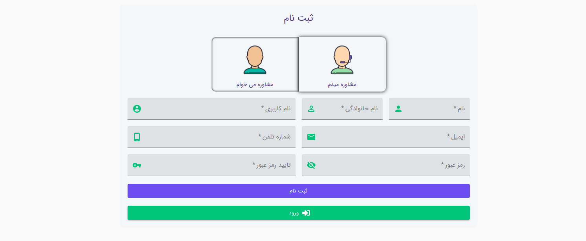
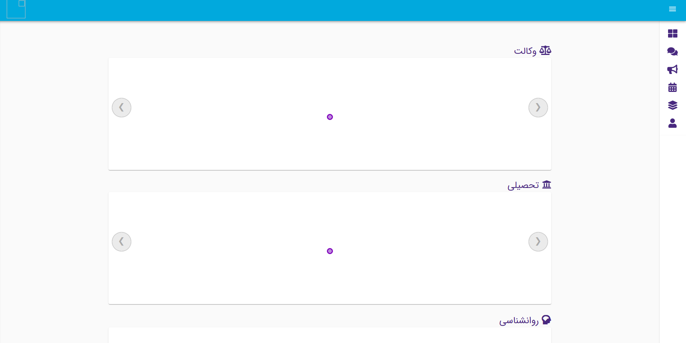
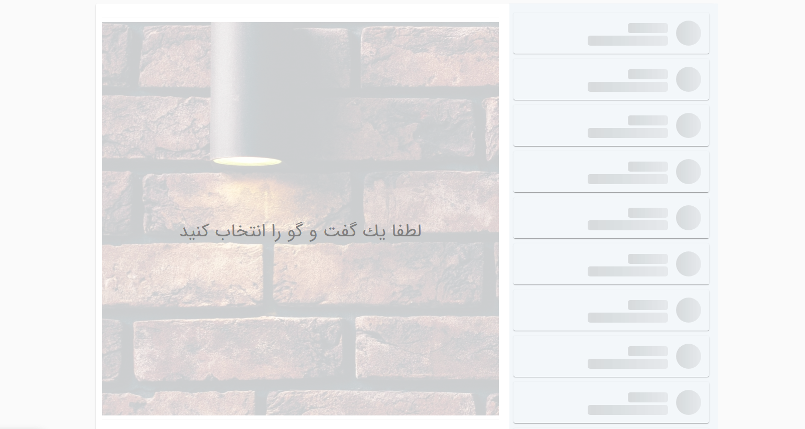
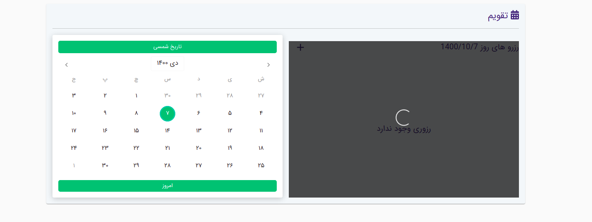
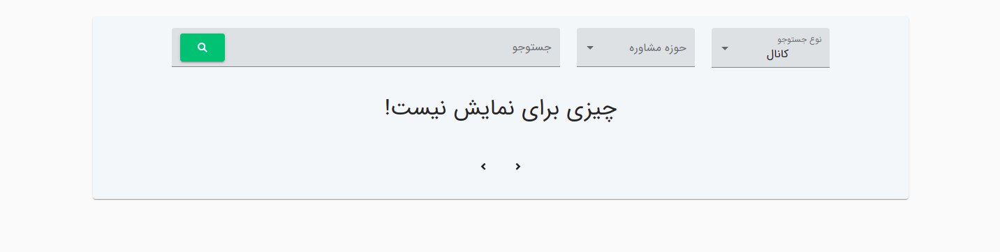

# Pargar
 

## Description
Pargar is a site that allows experts to transfer experience.
This site includes a social network that provides video calling and text chat.

# Getting Started
## Dependencies
Dependencies are listed in requirements.txt file and automatically installed by Docker.


## Executing
Install and run robot with docker-compose

```bash
  sudo docker-compose up
```

## Demo







## Authors

- [Hamidreza Azarbad](https://www.github.com/hamidreza7799)
- [Mojtaba Nafez](https://www.github.com/mojtaba-nafez)